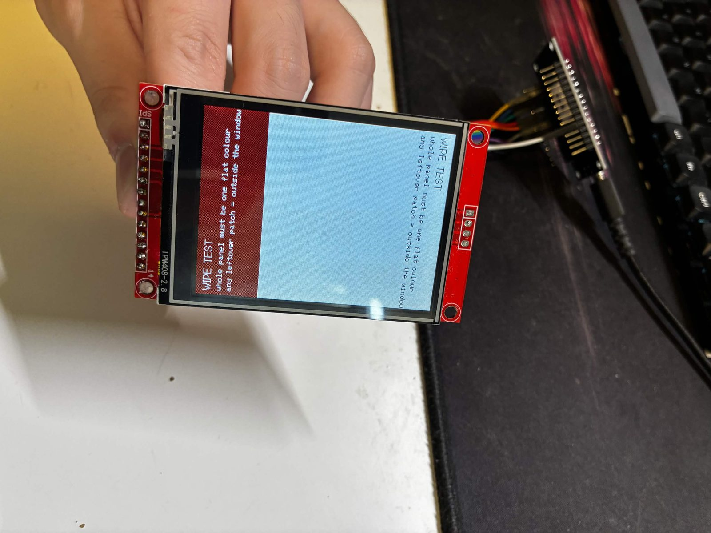
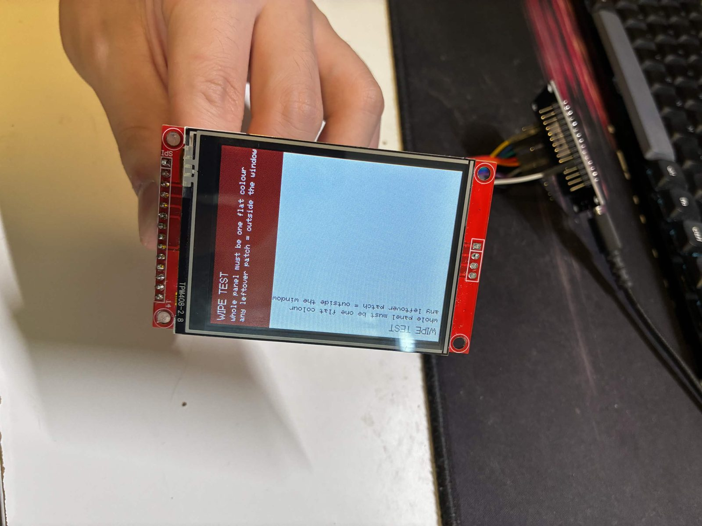
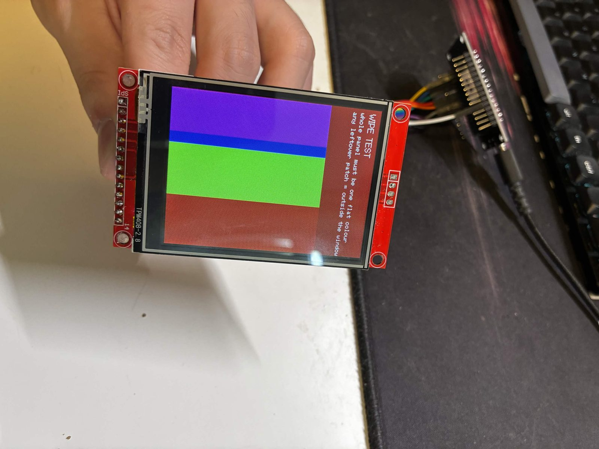
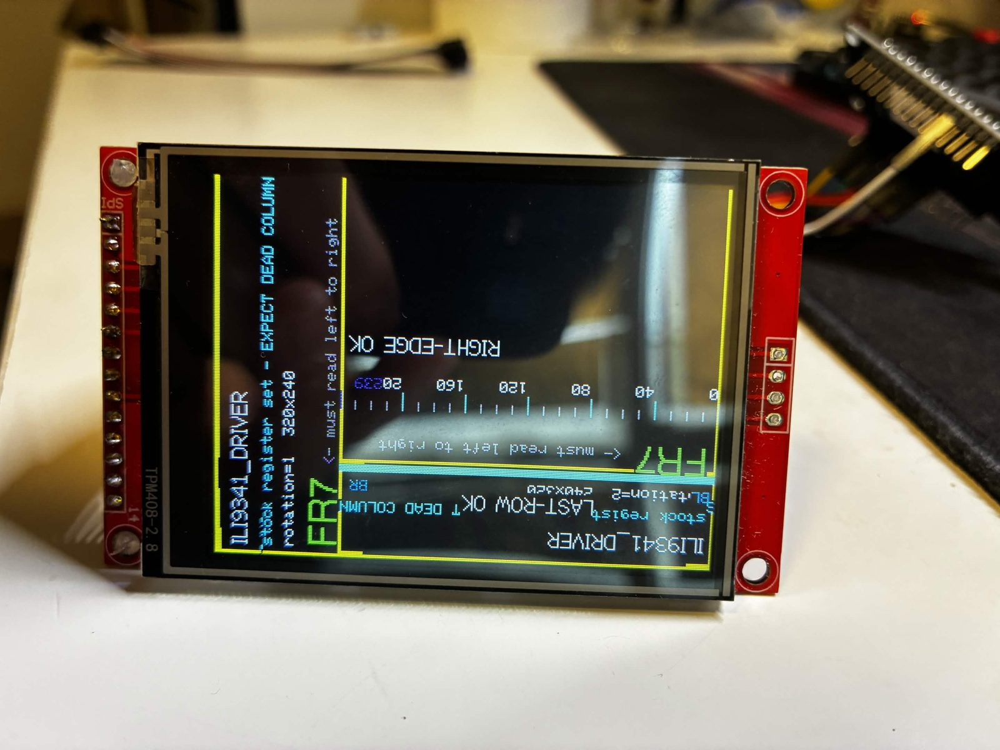
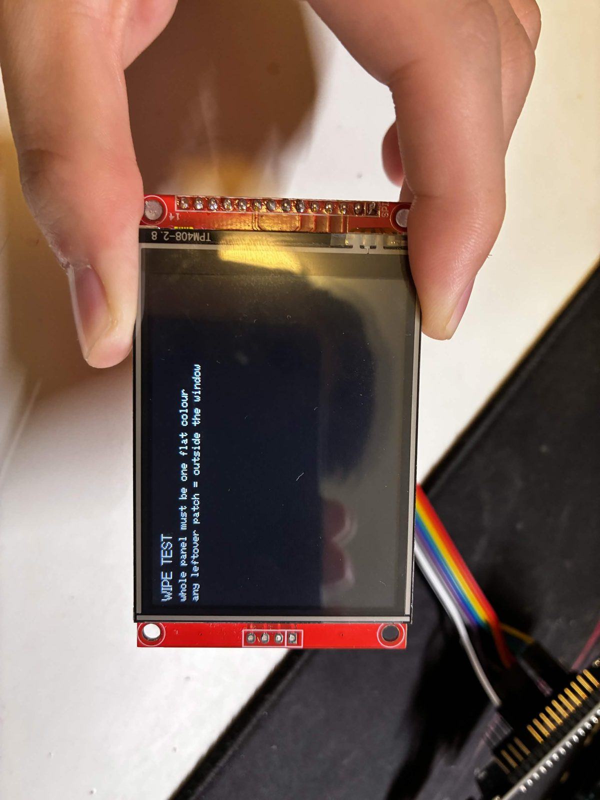
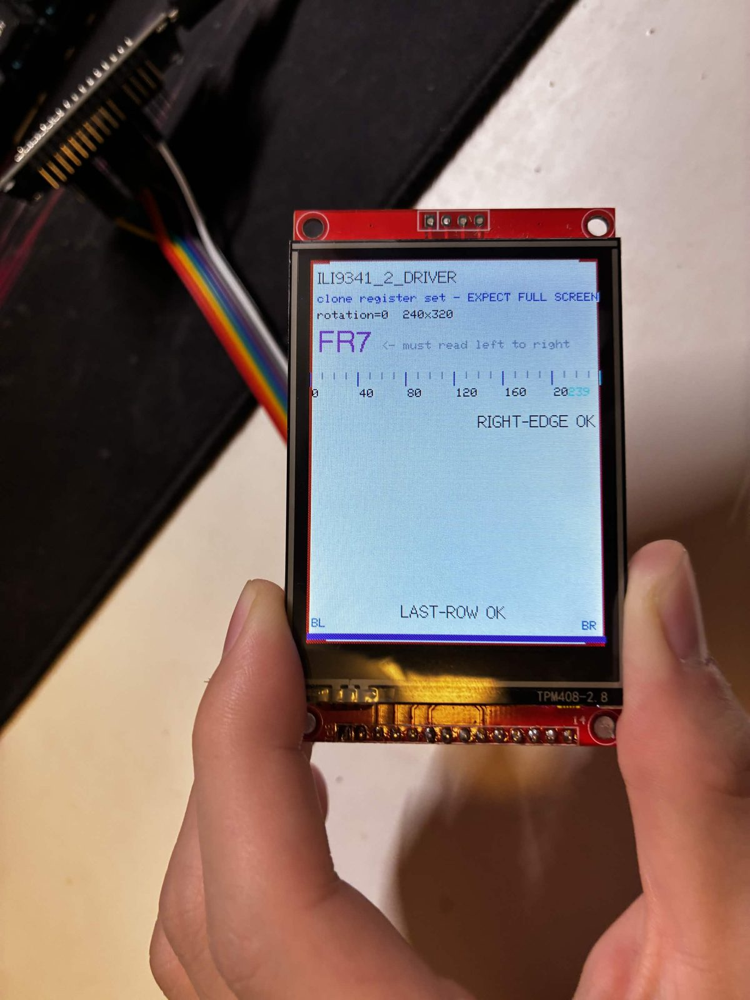

# The Dead Quarter

**A quarter of your cheap 2.8" ILI9341 panel never updates — and the one build
flag that fixes it.**

繁體中文版：[README.zh-TW.md](README.zh-TW.md)

A minimal PlatformIO project for the NodeMCU v3 (ESP8266) that demonstrates this
failure and its fix **on one board, with one source file, in two builds**. If you
landed here from a search, [the explanation](#what-is-actually-wrong) is probably
what you want; the demo exists so you can prove it to yourself in two minutes.


*`ILI9341_DRIVER` on a clone panel, mid-way through a `fillScreen(TFT_WHITE)`.
The strip on the right is still displaying the **entire previous screen** —
header text, `FR7`, everything. `fillScreen()` cannot reach it. No amount of
drawing will.*

---

## The symptom

After `tft.init()`, most of the panel draws correctly, but **roughly a quarter of
it never updates**. It keeps showing whatever was on screen before — old text
under new graphics, old colour bands beside new text — no matter what your
program draws.

It is not a wiring fault, not a bad panel, not SPI running too fast, and not a
buffer-size problem in your sketch. It is the wrong controller init sequence.

Two more things go with it, and both are useful for identification:

**Content wraps around.** Anything drawn near the end of the canvas turns up near
the *start* of the panel. In the photo above, `LAST-ROW OK` and the `BL` / `BR`
corner labels are drawn at the bottom of a 320-pixel-tall canvas, and they appear
in the header area instead.

**The dead strip moves between rotations.** `setRotation()` rewrites `MADCTL`,
which changes the scan direction, so the unreachable region jumps to a different
physical edge. It is *not* fixed to one side of the board — if you check only one
rotation you can easily conclude the panel is fine.

| | |
|---|---|
|  |  |
| Another rotation, same build: now the stale strip is on the **left**, holding the *previous* wipe colour. The caption appears twice — the wrap, printing it a second time. | The wrap again, from a different angle: a second, inverted copy of the caption along the bottom edge. |
|  |  |
| The four-band fill cannot reach the right-hand strip either — the previous screen's text is still readable there. | Wrapping in the diagnosis page: it is drawn over itself, one copy inverted. |

---

## Try it yourself

Two environments, **identical `src/main.cpp`**. Only the driver variant differs,
so anything you see on the glass is caused by the init sequence and nothing else.

| Environment | Driver flag | Expected result |
|---|---|---|
| `nodemcu_wrong` | `ILI9341_DRIVER` | ~25% of the panel never updates |
| `nodemcu_right` | `ILI9341_2_DRIVER` | whole panel addressed correctly |

```sh
pio run -e nodemcu_wrong -t upload && pio device monitor
pio run -e nodemcu_right -t upload && pio device monitor
```

The sketch reports its compiled driver over serial and on screen, so the build
and the physical panel can be compared directly.

### The one check that matters

The demo opens with a **wipe test**: it fills the entire canvas with a flat
colour, several times, alternating white and navy, in all four rotations.

> If the driver and the panel agree on the geometry, the whole physical panel
> changes colour together, every time. Any patch that keeps showing the previous
> screen is outside the addressable window, and nothing you draw will ever reach
> it.

**Everything else on screen is diagnosis, not a verdict.** This is worth being
blunt about, because it is the trap this demo was rebuilt to avoid:

The driver's own 240×320 canvas stays perfectly self-consistent while the panel
is broken. Any marker drawn in driver coordinates will report a pass. What is
wrong is not the canvas; it is where the canvas lands on the glass. Only a
full-screen wipe tests that.


*Every marker passes. `tft.width()` returns `240`, the ruler's `239` label is
there, `RIGHT-EDGE OK` and `LAST-ROW OK` both read cleanly — and a strip of the
panel is still showing the previous screen. This photo is why the wipe test
exists. (`LAST-ROW OK` is drawn at the bottom of the canvas and appears in the
header here; that is the wrap.)*

### What it looks like when it's right

| | |
|---|---|
|  |  |
| `ILI9341_2_DRIVER`, same board, same wiring. The wipe covers the whole panel — this is a pass. | `rotation=0`, `240x320`. The whole page fits, the ruler reaches `239`, `FR7` reads left to right, and `BL` / `BR` are in the bottom corners where they belong. |


*`rotation=3`, `320x240`. Landscape works too, ruler out to `319`, nothing
wrapping.*

**Note the colours in those last two.** The sketch clears to `TFT_BLACK` and
draws `FR7` in green; the panel shows a white background and a purple `FR7`.
That is side-effect 1 below — **this particular module also needs
`TFT_INVERSION_ON`**. The geometry is fixed and the colours are not, which is the
cleanest illustration of why those are two separate problems. The flag is left
commented out in `platformio.ini` on purpose: enable it if your module shows this,
leave it alone if your colours already look right.

---

## What is actually wrong

### The controller isn't really an ILI9341

Cheap 2.8" 240×320 modules — including the all-in-one boards built around this
same panel, such as the **ESP32-2432S028**, known in the hobby community as the
"CYD" (*Cheap Yellow Display*) — almost never carry a genuine Ilitek ILI9341
controller. They carry a clone.

The clone understands the same *commands*. Send it `0x2A` and it knows you mean
"set the column address window". That is why the display isn't simply dead: a lot
of it works.

What the clone does **not** share is the startup sequence. It needs different
internal power settings (registers `PWCTR1` and `PWCTR2`), different
liquid-crystal voltage levels (VCOM, via `VMCTR1` and `VMCTR2`), different
colour-curve corrections (the gamma tables), and a different default for
`MADCTL` — the register that defines orientation and memory scan direction.

### The driver and the panel disagree about the geometry

After a stock ILI9341 init, the clone does not lay its memory out the way the
driver assumes. The library keeps writing a 240-wide, 320-tall canvas; the panel
accepts those writes into a differently-shaped region. Two consequences follow,
and they are exactly what the photos show:

```
   library writes a 240 x 320 canvas
              |
              v
   panel accepts it into a region of a different shape
              |
              +---------------------------+
              |                           |
              v                           v
   along one axis the canvas       along the other it runs
   is SHORTER than the panel       PAST the end of the panel
              |                           |
              v                           v
   ~25% of the glass is never      the overflow wraps around
   written -> keeps showing        -> bottom-of-canvas content
   the previous screen             appears at the top
```

`240 / 320 = 75%`, which is where the missing quarter comes from, and it is the
same proportion reported on the CYD.

> **Scope note.** The register-level cause was not traced — no logic analyser was
> put on the bus. What is confirmed is the behaviour above, on two different
> boards, and that switching the driver variant fixes it. The geometry
> explanation is the reading that accounts for all of the observations; treat the
> mechanism as inference and the symptoms and the fix as fact.

### Why the unreachable region shows old content, not black

GRAM (Graphics RAM) is the video memory inside the display controller itself, not
in the microcontroller. It is never cleared unless something writes to it, so a
region your sketch cannot reach simply keeps displaying whatever was last written
there — or, right after power-on, undefined noise.

That is the whole reason this bug is so confusing: it doesn't look like an error.
It looks like the display is showing a *different program's* output, or like the
panel is physically damaged, or like a data line has a bad solder joint. It is
none of those.

### Why the microcontroller can't just detect it

It cannot ask the panel. ILI9341-class displays do not reliably report their
identifier over SPI: some clones return nothing, some return random values, some
return a genuine ILI9341 ID despite having incompatible internals.

So every graphics library on every platform picks its register set from a
compile-time `#define` and simply trusts it. The firmware genuinely believes it is
addressing the whole panel, and every self-check it can perform agrees with it.

**You are the detector.** There is no software check the MCU can run on its own;
the fault can only be seen by looking at the physical screen.

---

## Telling it apart from a wiring problem

Both can produce a mess on screen, and the fixes have nothing in common. Check
this *before* you start re-seating jumper wires.

| | Wrong init sequence | Bad wiring / SPI too fast |
|---|---|---|
| The affected region | a clean, straight-edged area that **never updates** | no clean boundary |
| Behaviour over time | perfectly stable | sparkles, flickers, changes |
| Between rotations | the region moves to a different edge | unrelated to rotation |
| Effect of lowering `SPI_FREQUENCY` | none at all | improves or disappears |

A stable, hard-edged region that refuses to update is the signature of this bug.
If dropping the SPI clock from 40 MHz to 27 MHz helps, you have the *other*
problem — signal integrity on long jumper wires, and no driver flag will fix it.

---

## The fix

```ini
-D ILI9341_2_DRIVER=1     ; instead of  -D ILI9341_DRIVER=1
```

TFT_eSPI includes the clone's register set as a dedicated driver. That is all it
takes.

On other libraries:

| Library | Clone variant |
|---|---|
| **TFT_eSPI** (bodmer) | `ILI9341_2_DRIVER` — this is the path confirmed working here |
| **LovyanGFX** | the `Panel_ILI9341_2` class (but read the MADCTL note below) |
| **Adafruit_ILI9341** | **none — there is no flag.** Migrating to TFT_eSPI or LovyanGFX is part of the fix. |

### What does not fix it

**Initialising at a different rotation.** Because `setRotation()` rewrites
`MADCTL`, it is a natural thing to try, and it *looks* like progress: on a CYD it
got the panel to come up at all when it otherwise would not. But it stops there.
The panel initialises; drawing into it is still broken. Treat a different
rotation as a way to get a first sign of life out of a board, not as a fix — the
register set is still wrong, and only the driver variant addresses that.

### Two side effects you might hit next

Neither means the flag was wrong. They are secondary effects of the same hardware
mismatch.

**1. Colours may be inverted.** Green comes out purple, white backgrounds come out
black or navy. The clone's default inversion state differs from the standard one.
**Only if you actually see this**, add:

```ini
-D TFT_INVERSION_ON=1
```

If your colours are already correct, leave it out — on a panel with standard
polarisers this flag would invert them.

**2. Text may read backwards after `setRotation()`.** The `_2` variant initialises
`MADCTL` (command `0x36`) with byte `0x08` instead of the `0x48` the standard
driver uses, so a given rotation index can come out mirrored. Try all four
indices, `setRotation(0)` through `setRotation(3)`, and use the one where text
reads left to right.

> **A centred, symmetric test pattern cannot detect a mirrored display.**
> Under a mirror, every point of a centred square still lands on the square. The
> test passes. The panel is wrong.

That is why this demo prints an asymmetric label (`FR7`) and marks the
bottom-left (`BL`) and bottom-right (`BR`) corners rather than a tidy centred
colour square. The trap is real: on a CYD, LovyanGFX's `Panel_ILI9341_2` fixed
the dead region but produced a mirrored `setRotation(1)`; the correct rotation
index was never found and that project moved to TFT_eSPI instead.

---

## Wiring — NodeMCU v3 → module

`MOSI`, `SCK` and `MISO` are the ESP8266's fixed HSPI pins and cannot be moved.
`CS`, `DC` and `RST` are free choices; these three were picked because none of
them fights the ESP8266's boot strapping.

| Module pin | NodeMCU | GPIO | Note |
|---|---|---|---|
| `VCC` | `3V3` | — | 3.3 V only. Do **not** feed 5 V unless the module has a regulator *and* level shifters. |
| `GND` | `GND` | — | |
| `CS` | `D1` | 5 | |
| `RESET` | `D4` | 2 | GPIO2 has an onboard pull-up, so it idles HIGH through boot. |
| `DC` / `RS` | `D2` | 4 | |
| `SDI` / `MOSI` | `D7` | 13 | HSPI, fixed |
| `SCK` | `D5` | 14 | HSPI, fixed |
| `LED` | `3V3` | — | The series resistor is usually already on the module. Wire to a GPIO instead if you want PWM dimming. |
| `SDO` / `MISO` | `D6` | 12 | HSPI, fixed. Optional — only needed for register readback. |

The touch header (`T_CLK` / `T_CS` / `T_DIN` / `T_DO` / `T_IRQ`) is left
unconnected. This demo is display-only on purpose: touch is a separate XPT2046
controller and adds nothing to the question of whether the panel initialises.

If you see sparkle or intermittent noise, drop `SPI_FREQUENCY` from `40000000` to
`27000000`. That is signal integrity on long jumper wires — a different problem
from the one above, and it moves and flickers where an unreachable region does
not.

---

## What the demo draws

1. **Wipe test**, in all four rotations — the pass/fail check described above.
   Everything below this line is diagnosis.
2. **Four-band fill** (red / green / blue / magenta, full width) — an unreachable
   region is obvious without reading anything, and whatever survives from the
   previous screen proves the wipe could not clear it.
3. **Edge frame + corner ticks.**
4. **Column ruler**, labelled every 40 px, with the last addressable column marked
   in red — catches a driver that disagrees with *itself* about the canvas size.
5. **`RIGHT-EDGE OK` and `LAST-ROW OK`** — same purpose. Read them as "the canvas
   is internally consistent", never as "the panel is fine".
6. **`FR7` + `BL` / `BR` corner labels** — mirror detection.

---

## Carrying this to an ESP32

Only the pin map changes. `ILI9341_2_DRIVER` and `TFT_INVERSION_ON` are
properties of *the panel*, not of the microcontroller, so they carry over
untouched.

Two practical differences:

- SPI pins can be mapped to almost any GPIO on an ESP32, unlike the ESP8266 which
  relies on its dedicated hardware SPI pins (the HSPI bus: `MOSI` on GPIO13 /
  silkscreen D7, `SCK` on GPIO14 / D5, `MISO` on GPIO12 / D6).
- You can raise `SPI_FREQUENCY`, but only over short electrical paths. A CYD
  handles 55 MHz because its connections are traces on the PCB; jumper-wire
  setups should stay between 27 and 40 MHz regardless of the MCU's rated speed.

### Known-good CYD configuration (ESP32-2432S028)

That board *is* this panel soldered to an ESP32, so everything above applies to it
unchanged.

```ini
-D USER_SETUP_LOADED=1
-D USE_HSPI_PORT
-D ILI9341_2_DRIVER=1
-D TFT_INVERSION_ON=1
-D TFT_MISO=12 -D TFT_MOSI=13 -D TFT_SCLK=14
-D TFT_CS=15   -D TFT_DC=2    -D TFT_RST=-1
-D TFT_BL=21   -D TFT_BACKLIGHT_ON=HIGH
-D SPI_FREQUENCY=55000000
-D SPI_READ_FREQUENCY=20000000
-D SPI_TOUCH_FREQUENCY=2500000
```

- `tft.setRotation(1)` — confirmed unmirrored, and matches the touch mapping.
- Touch is XPT2046 on a **separate VSPI bus**: `CLK=25 MOSI=32 MISO=39 CS=33
  IRQ=36`, `touchscreen.setRotation(1)`, raw ADC calibration x 200–3700,
  y 240–3800.
- `LGFX_AUTODETECT` does **not** cover this board (the panel ID is unreadable) —
  manual configuration only.
- The board has **no PSRAM** and **no TE (tearing-effect) pin**.

---

## Notes

- The whole TFT_eSPI configuration lives in `build_flags` with
  `USER_SETUP_LOADED`, so the library's own `User_Setup.h` is never edited and a
  `pio pkg update` cannot silently revert it.
- [`docs/AI_CONTEXT.md`](docs/AI_CONTEXT.md) is the same knowledge written for an
  LLM to consume — paste it into an assistant before asking it for help with this
  panel. It includes a diagnosis priority order, because the default reflex when
  told "part of my screen is wrong" is to investigate wiring, which is exactly the
  wrong first move here.
- Photos in [`docs/img/`](docs/img/) are of the actual failure on the actual
  hardware, not mock-ups.

Everything stated here was observed on physical hardware: the bare module on a
NodeMCU v3, and previously an ESP32-2432S028. Where something is inference rather
than observation, it says so.

## License

MIT — see [LICENSE](LICENSE).
