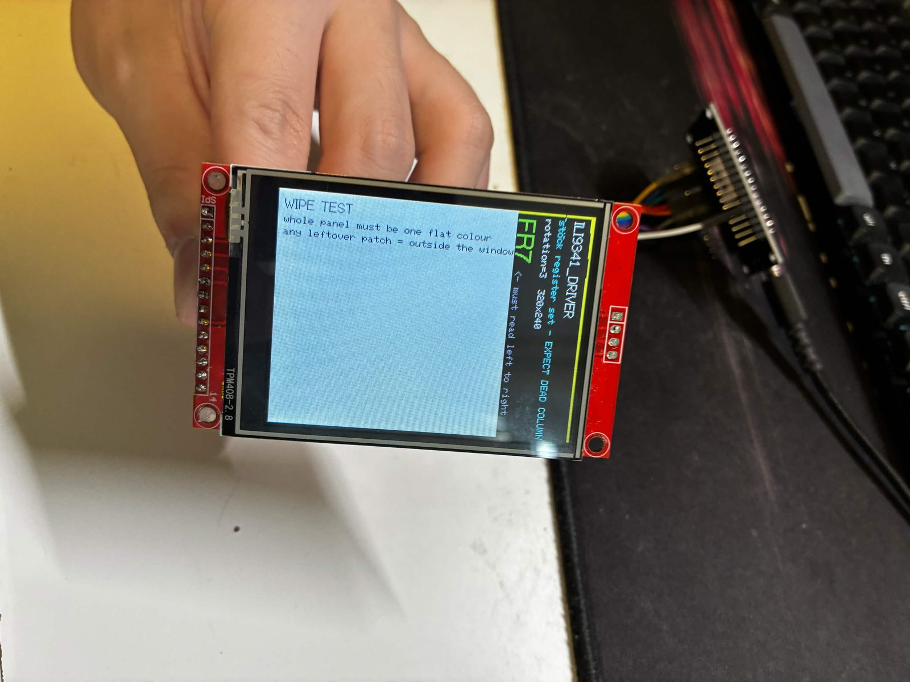
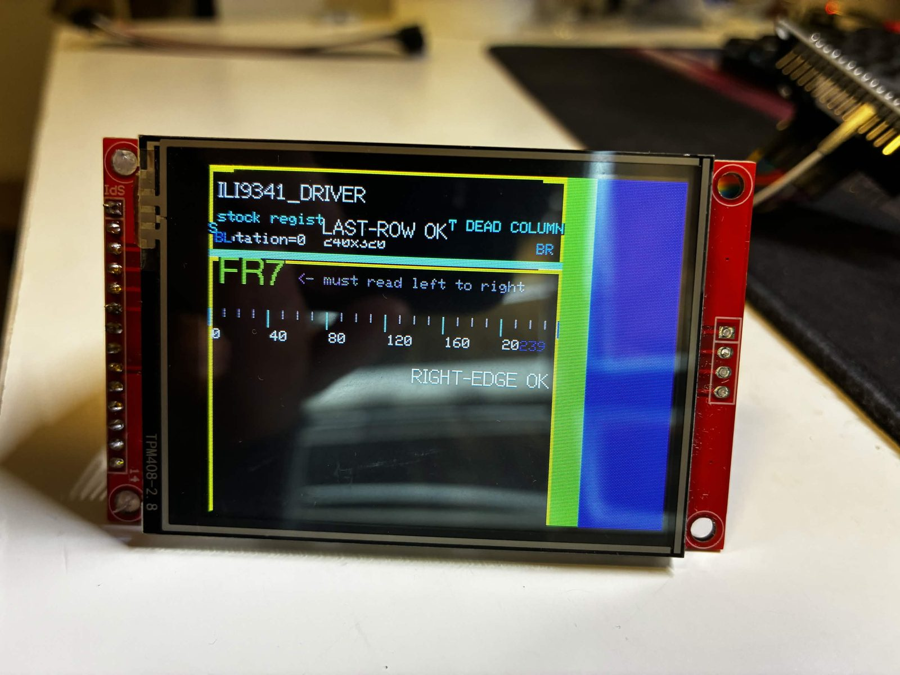

# 死掉的那一角

**便宜的 2.8" ILI9341 面板有四分之一永遠不會更新 —— 以及修好它的那一個 build flag。**

English: [README.md](README.md)

一個給 NodeMCU v3（ESP8266）的極簡 PlatformIO 專案，用**同一塊板、同一份原始碼、兩個
build**，把這個故障和它的修法直接演示出來。如果你是搜尋進來的，[到底哪裡壞了](#到底哪裡壞了)
大概才是你要的；這個 demo 的存在只是讓你能在兩分鐘內親手驗證一次。



*Clone 面板配 `ILI9341_DRIVER`，`fillScreen(TFT_WHITE)` 執行到一半。右側那一條還完整顯示著
**上一整頁畫面** —— 標題文字、`FR7`，全部都在。`fillScreen()` 到不了那裡，你畫什麼都到不了。*

---

## 症狀

`tft.init()` 之後，面板大部分正常繪製，但**大約四分之一永遠不會更新**。它一直顯示著先前
畫面上的東西 —— 新圖形底下壓著舊文字、新文字旁邊留著舊色帶 —— 無論你的程式往那裡畫什麼。

這不是接線問題，不是面板壞掉，不是 SPI 跑太快，也不是你 sketch 的 buffer 大小有問題。
是控制器的初始化序列用錯了。

還有兩個伴隨現象，都很適合拿來辨識：

**內容會繞回來。** 任何畫在畫布尾端的東西會跑到面板的**開頭**。上面那張照片裡，
`LAST-ROW OK` 和 `BL` / `BR` 角標是畫在 320 px 高的畫布底部的，結果出現在標題區。

**壞掉那條會隨 rotation 換邊。** `setRotation()` 會改寫 `MADCTL`，掃描方向跟著變，
碰不到的區域就跳到另一個實體邊緣。它**不是**固定在板子的某一側 ——
如果你只檢查一個 rotation，很容易誤判面板是好的。

| | |
|---|---|
|  |  |
| 同一個 build、不同 rotation：殘留那條跳到了**左邊**，裡面是*上一次*的填色。說明文字出現兩次 —— 繞回把它又印了一次。 | 另一個角度看繞回：底部那一行是倒著的第二份說明文字。 |
|  |  |
| 四色帶同樣到不了右側那條 —— 上一頁的文字還讀得出來。 | 診斷頁的繞回：整頁疊在自己身上，其中一份是倒的。 |

---

## 自己跑一次

兩個 environment，**`src/main.cpp` 完全相同**，只有 driver 變體不同 ——
所以螢幕上任何差異都只可能來自初始化序列。

| Environment | Driver flag | 預期結果 |
|---|---|---|
| `nodemcu_wrong` | `ILI9341_DRIVER` | 約 25% 的面板永遠不更新 |
| `nodemcu_right` | `ILI9341_2_DRIVER` | 整片面板正確定址 |

```sh
pio run -e nodemcu_wrong -t upload && pio device monitor
pio run -e nodemcu_right -t upload && pio device monitor
```

Sketch 會在 serial 和螢幕上都印出自己編譯進去的 driver 名稱，讓 build 和實體面板可以直接對照。

### 唯一算數的那個檢查

Demo 一開始是 **wipe test**：用純色把整個畫布填滿，白色和深藍交替數次，四個 rotation 各跑一遍。

> 如果 driver 和面板對幾何的認知一致，整片實體面板會一起換色，每一次都是。
> 任何一塊還顯示著上一頁的區域，就是在可定址範圍之外 —— 你畫什麼都到不了那裡。

**螢幕上其他東西都是診斷資訊，不是判決。** 這點值得說白，因為這正是這個 demo 重做過一次
才避開的陷阱：

面板壞著的時候，driver 自己那塊 240×320 畫布**依然完全自洽**。任何畫在 driver 座標系裡的
marker 都會回報通過。錯的不是畫布，是那塊畫布落在玻璃上的位置。只有整片填色測得出來。



*每一個 marker 都通過。`tft.width()` 回傳 `240`，ruler 的 `239` 標籤在，`RIGHT-EDGE OK` 和
`LAST-ROW OK` 都讀得清楚 —— 而面板有一條還顯示著上一頁。這張照片就是 wipe test 存在的理由。
（`LAST-ROW OK` 是畫在畫布底部的，這裡出現在標題區 —— 那就是繞回。）*

---

## 到底哪裡壞了

### 那顆控制器不是真的 ILI9341

便宜的 2.8" 240×320 模組 —— 包括用同一片面板做成的整合板，例如 **ESP32-2432S028**，
社群通稱 **CYD**（*Cheap Yellow Display*）—— 幾乎都不是原廠 Ilitek ILI9341，而是 clone。

Clone 認得同一套**指令**。送 `0x2A` 給它，它知道你是要「設定欄位位址視窗」。這正是為什麼
螢幕不是整片死掉：大部分功能是正常的。

Clone **不**共用的是啟動序列。它需要不同的內部電源設定（暫存器 `PWCTR1`、`PWCTR2`）、
不同的液晶電壓（VCOM，透過 `VMCTR1`、`VMCTR2`）、不同的色彩曲線修正（gamma 表），
以及不同的 `MADCTL` 預設值 —— 那是決定方向與記憶體掃描方向的暫存器。

### Driver 和面板對「幾何」的認知不一致

送完一份原廠 ILI9341 的初始化之後，clone 的記憶體排列方式和 driver 假設的不同。
函式庫照樣寫一塊 240 寬、320 高的畫布，面板卻把這些寫入收進一塊形狀不同的區域。
後果有兩個，而且正好就是照片上看到的：

```
   函式庫寫出一塊 240 x 320 的畫布
              |
              v
   面板把它收進一塊形狀不同的區域
              |
              +---------------------------+
              |                           |
              v                           v
   在其中一軸上，畫布比面板「短」    在另一軸上，畫布「超出」面板尾端
              |                           |
              v                           v
   約 25% 的玻璃從未被寫入          溢出的部分繞回開頭
   -> 一直顯示上一頁的內容          -> 畫布底部的內容出現在頂端
```

`240 / 320 = 75%`，少掉的那四分之一就是這麼來的，也和 CYD 上回報的比例相同。

> **範圍聲明。** 暫存器層級的成因**沒有**追到底 —— 沒有把邏輯分析儀接上 bus。
> 已確認的是上述行為（在兩塊不同的板子上），以及換 driver 變體就能修好。
> 幾何解釋是唯一能同時解釋所有觀察的說法；把**機制當成推論**，把**症狀和修法當成事實**。

### 為什麼碰不到的區域顯示舊內容，而不是黑色

**GRAM**（Graphics RAM）是顯示控制器**自己內部**的顯示記憶體，不在微控制器裡。
除非有人寫入，否則它永遠不會被清空 —— 所以你 sketch 碰不到的區域，就只是繼續顯示
最後被寫進去的東西；剛開機時則是未定義的雜訊。

這就是這個 bug 難纏的全部原因：它不像個錯誤。它看起來像是螢幕在顯示**另一個程式**的輸出、
或是面板實體受損、或是某條資料線虛焊。三者都不是。

### 為什麼微控制器無法自己偵測

它問不到面板。ILI9341 這類顯示器透過 SPI 回報識別碼並不可靠：有些 clone 什麼都不回，
有些回隨機值，有些明明內部完全不相容卻回報一個貨真價實的 ILI9341 ID。

所以每個平台上的每個繪圖函式庫，都是從編譯期的 `#define` 挑一組暫存器設定，然後就這麼信了。
韌體是真心認為自己正在定址整片面板，而且它能做的每一項自我檢查都同意它。

**偵測器是你。** 沒有任何軟體檢查能讓 MCU 自己跑出結果；這個故障只能靠看實體螢幕來確認。

---

## 怎麼跟接線問題區分

兩者都會讓畫面一團亂，但修法毫無共通之處。在你開始重插杜邦線**之前**先做這個判別。

| | 初始化序列錯誤 | 接線不良 / SPI 太快 |
|---|---|---|
| 受影響的區域 | 邊緣筆直乾淨、**永遠不更新**的一塊 | 沒有乾淨的界線 |
| 隨時間的表現 | 完全穩定 | 閃爍、跳動、會變 |
| 換 rotation 時 | 那塊區域跳到另一個邊緣 | 和 rotation 無關 |
| 降低 `SPI_FREQUENCY` 的效果 | 完全沒有影響 | 改善或消失 |

一塊穩定、邊緣銳利、就是不更新的區域，是這個 bug 的簽名。如果把 SPI clock 從 40 MHz
降到 27 MHz 有幫助，那你遇到的是**另一個**問題 —— 長杜邦線的訊號完整性，任何 driver
flag 都救不了。

---

## 修法

```ini
-D ILI9341_2_DRIVER=1     ; 取代 -D ILI9341_DRIVER=1
```

TFT_eSPI 把 clone 的暫存器組收錄成一個獨立的 driver。就這樣而已。

其他函式庫：

| 函式庫 | Clone 變體 |
|---|---|
| **TFT_eSPI**（bodmer） | `ILI9341_2_DRIVER` —— 本專案實測可行的路徑 |
| **LovyanGFX** | `Panel_ILI9341_2` 類別（但請看下方的 MADCTL 警告） |
| **Adafruit_ILI9341** | **沒有，也沒有任何 flag。** 換函式庫到 TFT_eSPI 或 LovyanGFX 本身就是修復的一部分。 |

### 什麼**不能**修好它

**用不同的 rotation 初始化。** 因為 `setRotation()` 會重寫 `MADCTL`，這是很自然會想試的一招，
而且看起來*像*有進展：在一塊 CYD 上，這讓原本根本不會亮的面板能初始化成功。但就到此為止 ——
**面板 init 得了，畫進去還是壞的**。把換 rotation 當成「讓一塊板子先有反應」的手段，
不要當成修復：暫存器組還是錯的，而只有 driver 變體能處理那件事。

### 接下來可能出現的兩個副作用

兩者都不代表 flag 下錯了。它們是同一個硬體不相容的次級效應。

**1. 顏色可能會反相。** 綠色變紫色，白色背景變黑色或深藍。Clone 的預設反相狀態和標準的不同。
**只有在你真的看到這個症狀時**才加上：

```ini
-D TFT_INVERSION_ON=1
```

如果你的顏色本來就正常，就別加 —— 在偏光片是標準規格的面板上，這個 flag 會把正確的顏色弄反。

**2. `setRotation()` 之後文字可能變成鏡像。** `_2` 變體把 `MADCTL`（指令 `0x36`）初始化成
位元組 `0x08`，而不是標準 driver 用的 `0x48`，所以某個旋轉索引可能會出來是鏡像的。
四個索引 `setRotation(0)` 到 `setRotation(3)` 都試一遍，用文字能從左讀到右的那一個。

> **置中對稱的測試圖案無法偵測鏡像。**
> 鏡像之下，置中方塊的每一個點仍然落在方塊上。測試通過，面板是錯的。

這就是為什麼這個 demo 印的是一組不對稱的字（`FR7`）並標記左下（`BL`）、右下（`BR`）角，
而不是畫一個漂亮的置中色塊。這個陷阱是真的踩過的：在一塊 CYD 上，LovyanGFX 的
`Panel_ILI9341_2` 修好了壞區，卻產生一個鏡像的 `setRotation(1)`，正確的旋轉索引始終沒找到，
那個專案最後改用 TFT_eSPI。

---

## 接線 —— NodeMCU v3 → 模組

`MOSI`、`SCK`、`MISO` 是 ESP8266 固定的 HSPI 腳位，不能改。`CS`、`DC`、`RST` 可以自由選；
這三個是刻意挑的，都不會和 ESP8266 的開機腳位設定衝突。

| 模組腳位 | NodeMCU | GPIO | 說明 |
|---|---|---|---|
| `VCC` | `3V3` | — | **只能 3.3 V**。除非模組同時有穩壓器**和**電平轉換，否則不要接 5 V。 |
| `GND` | `GND` | — | |
| `CS` | `D1` | 5 | |
| `RESET` | `D4` | 2 | GPIO2 有 onboard pull-up，開機期間維持高電位。 |
| `DC` / `RS` | `D2` | 4 | |
| `SDI` / `MOSI` | `D7` | 13 | HSPI，固定 |
| `SCK` | `D5` | 14 | HSPI，固定 |
| `LED` | `3V3` | — | 限流電阻通常已在模組上。想做 PWM 調光就改接 GPIO。 |
| `SDO` / `MISO` | `D6` | 12 | HSPI，固定。可不接 —— 只有回讀暫存器才需要。 |

觸控排針（`T_CLK` / `T_CS` / `T_DIN` / `T_DO` / `T_IRQ`）刻意不接。這個 demo 只做顯示：
觸控是獨立的 XPT2046 控制器，對「面板有沒有正確初始化」這個問題毫無幫助。

如果你看到閃爍或間歇性雜訊，把 `SPI_FREQUENCY` 從 `40000000` 降到 `27000000`。那是長杜邦線
的訊號完整性問題 —— 和上面講的是不同的病：它會動、會閃，而碰不到的區域不會。

---

## Demo 畫了什麼

1. **Wipe test**，四個 rotation 各一遍 —— 上面說的那個 pass/fail 檢查。這條線以下全部只是診斷。
2. **四色橫帶填滿**（紅／綠／藍／洋紅，滿寬）—— 碰不到的區域不用讀字就看得出來，
   而且從上一頁活下來的東西，正好證明 wipe 清不掉它。
3. **邊框 + 角落刻度。**
4. **Column ruler**，每 40 px 標一次，最後一個可定址欄位標紅 ——
   抓的是「driver 對自己畫布大小的認知前後不一致」這種**另一種**故障。
5. **`RIGHT-EDGE OK` 和 `LAST-ROW OK`** —— 同上。把它們讀成「畫布內部自洽」，
   絕不要讀成「面板沒問題」。
6. **`FR7` + `BL` / `BR` 角標** —— 鏡像偵測。

---

## 移植到 ESP32

只有腳位對照表要改。`ILI9341_2_DRIVER` 和 `TFT_INVERSION_ON` 是**面板**的屬性，不是
微控制器的屬性，所以原封不動帶過去。

兩個實務差異：

- ESP32 上 SPI 腳位幾乎可以映射到任何 GPIO，不像 ESP8266 得靠專用的硬體 SPI 腳位
  （HSPI bus：`MOSI` 在 GPIO13／絲印 D7，`SCK` 在 GPIO14／D5，`MISO` 在 GPIO12／D6）。
- 你可以把 `SPI_FREQUENCY` 拉高，但僅限於電氣路徑很短的情況。CYD 能跑 55 MHz 是因為
  它的連接是 PCB 上的走線；用杜邦線的話，不管 MCU 標稱能跑多快，都留在 27 到 40 MHz 之間。

### 已驗證的 CYD 設定（ESP32-2432S028）

那塊板**就是**這片面板焊在 ESP32 上，所以以上全部原樣適用。

```ini
-D USER_SETUP_LOADED=1
-D USE_HSPI_PORT
-D ILI9341_2_DRIVER=1
-D TFT_INVERSION_ON=1
-D TFT_MISO=12 -D TFT_MOSI=13 -D TFT_SCLK=14
-D TFT_CS=15   -D TFT_DC=2    -D TFT_RST=-1
-D TFT_BL=21   -D TFT_BACKLIGHT_ON=HIGH
-D SPI_FREQUENCY=55000000
-D SPI_READ_FREQUENCY=20000000
-D SPI_TOUCH_FREQUENCY=2500000
```

- `tft.setRotation(1)` —— 已確認非鏡像，且與觸控映射一致。
- 觸控是 XPT2046，在**獨立的 VSPI bus** 上：`CLK=25 MOSI=32 MISO=39 CS=33 IRQ=36`，
  `touchscreen.setRotation(1)`，原始 ADC 校正 x 200–3700，y 240–3800。
- `LGFX_AUTODETECT` **不**支援這塊板（panel ID 讀不到）—— 只能手動設定。
- 這塊板**沒有 PSRAM**，也**沒有 TE（tearing-effect）腳位**。

---

## 附註

- 整份 TFT_eSPI 設定都放在 `build_flags` 裡搭配 `USER_SETUP_LOADED`，所以函式庫自己的
  `User_Setup.h` 完全不用改，`pio pkg update` 也不會把設定悄悄還原掉。
- [`docs/AI_CONTEXT.md`](docs/AI_CONTEXT.md) 是同一套知識，但寫給 LLM 讀的 —— 在請 AI
  幫你處理這片面板之前，先把那份貼進去。它內含一個診斷優先順序，因為 AI 聽到
  「我螢幕有一塊不對」的預設反射就是去查接線，而那正是這裡最錯的第一步。
- [`docs/img/`](docs/img/) 裡的照片是實際硬體上的實際故障，不是示意圖。

本文所述全部經實體硬體驗證：裸模組接 NodeMCU v3，以及先前的 ESP32-2432S028。
凡是推論而非觀察的部分，文中都有標明。

## 授權

MIT —— 見 [LICENSE](LICENSE)。
